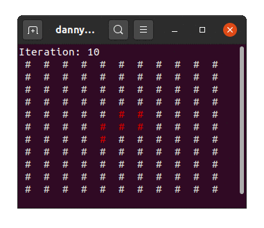
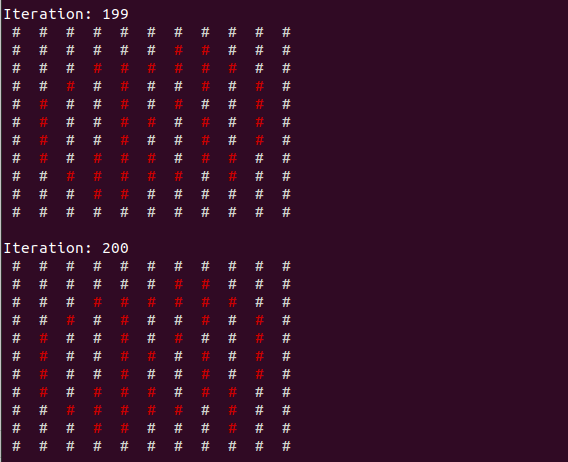
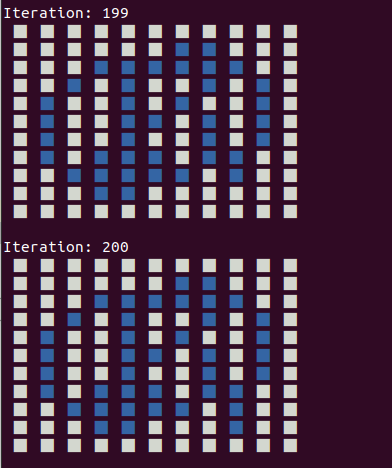
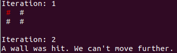

# Langton's ant
A simple simulation of Langton's ant



## Installation 
1. Clone this repo: `git clone https://github.com/dalvtor/langtons-ant.git`
2. Change the working directory to this project: `cd langston-ant`
3. Since this project has dependencies (just one dependency to color the output to the terminal), it is better to create a virtual
environment. This can be done by running ``virtualenv -p python3 env``. If you don't have virtualenv installed you can install it by running: ``pip install --upgrade virtualenv``
4. Activate the virtual environment by running ``source env/bin/activate``
5. Install the dependencies by running: ``pip install -r requirements.txt``
6. Everything should now be alright, you can check the next chapter, Running a simulation, to run a custom simulation,
or run the following command to try the default one: 
```
python simulation.py --file 'example/grid.json' --initial_x 5 --initial_y 5 --steps 200
```

## Running a simulation
It is possible to run a simulation of N steps by providing the following data:
- A file containing a valid grid in JSON format
- The starting X coordinate of the ant (0 based)
- The starting Y coordinate of the ant (0 based)
- The number of steps you wish to simulate

For simplicity, I've added a valid 11x11 grid in the example folder, under the `grid.json`file, but are welcome to use
any file with any kind of grid you want, you are also free to modify the given example.

In order to run the simulation just open a terminal and type the following:
```
python simulation.py --file 'example/grid.json' --initial_x 5 --initial_y 5 --steps 200
```
After hitting enter you should be able to see the simulation running.



Note that you must be in your virtual environment in order to run the simulation.

## Modifying the settings
There is a ``settings.py`` file that allows you to modify the colors, characters and time of the simulation.



## Hitting a wall
It is possible to hit a wall in some cases if the given grid is not large enough. For example, if we are given a 2x2 matrix
and the starting position of the ant is (0,0), it won't be able to go up. In those cases, you will see a message in the standard output 
stating that a wall was hit and the program will exit.




## API

The `LangtonsAnt` class has:

##### Attributes
- `grid`: The current state of the grid
- `position`: The current position of the ant
- `direction`: The current direction of the ant

##### Methods
- `next`: Moves the and one step forward according to the rules
- `draw_grid`: Draws the grid to the terminal
- `flip_color(x, y)`: Flips the color of a given `cell[x][y]`
- `rotate_clockwise`: Rotates the ant 90 degrees clockwise
- `rotate_anticlockwise`: Rotates the ant 90 degrees anticlockwise
- `simulate(steps)`: Simulates N steps

##### Properties
- `state`: The current state of the grid


## Running the tests
Simply run 
```
python -m tests.tests
```
